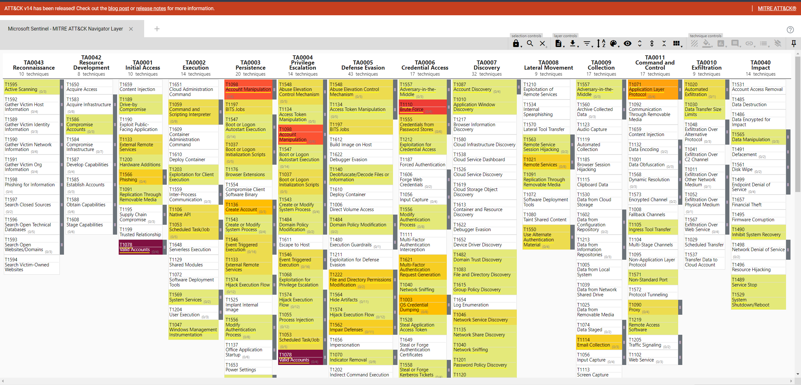

# SentinelReporter

This is a collection of Python scripts designed to generate reports for security teams from data in Microsoft Sentinel.

## Limitations

Due to the way the Azure REST API returns an AlertRule object, an accurate count of MITRE ATT&CK techniques per tactic is not possible. For example, the technique T1078 - Valid Accounts exists in the Initial Access, Persistence, Privilege Escalation and Defense Evasion tactics. In the event an analytic rule is not mapped to T1078 in each of those associated tactics, that rule is still counted for each tactic.

## Current features

* **MITRE ATT&CK Navigator Layer** - Retrieves the workspaces scheduled analytics rules and generates a JSON file to be used with the [MITRE ATT&CK Navigator](https://mitre-attack.github.io/attack-navigator/).

## How to use

Use `az login` to sign in to Azure before running the script.

```
python3 sentinelreporter.py -h
usage: sentinelreporter.py [-h] [--tenant TENANT] [--subscription_id SUBSCRIPTION_ID] [--resource_group RESOURCE_GROUP]
                           [--workspace WORKSPACE]

Sentinel Reporter - a python tool to generate reports from Microsoft Sentinel

optional arguments:
  -h, --help            show this help message and exit
  --tenant TENANT       Azure tenant ID
  --subscription_id SUBSCRIPTION_ID
                        Azure subscription ID
  --resource_group RESOURCE_GROUP
                        Microsoft Sentinel resource group name
  --workspace WORKSPACE
                        Microsoft Sentinel workspace name
```

Example output:

```
python3 sentinelreporter.py --tenant <guid> --subscription_id <subscription_id> --resource_group <rsg_name> --workspace <workspace_name>
[+] Setting up Azure client
[+] Getting scheduled analytics rules
100%|██████████████████████████████████████████████████████████████████████████████████████████████████████████████████████████████████████████████| 149/149 [00:53<00:00,  2.81it/s]
[+] Creating MITRE ATT&CK Navigator layer
```

This produces a JSON file that can be uploaded to the MITRE ATT&CK Navigator:

